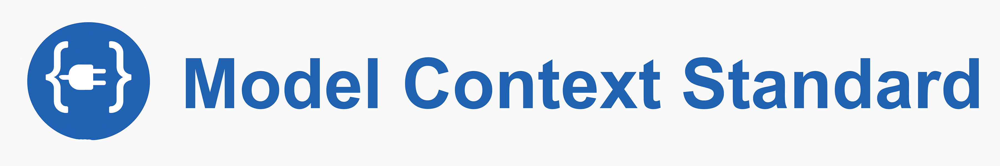

# Model Context Standard (MCS)

<p align="center">
  
</p>

**Unlock the Power of LLMs: Connect Any Model to the Real World with Plug & Play Drivers - Simpler, Safer and Infinitely Scalable**

Imagine transforming your LLM into a supercharged operating system. Effortlessly linking to APIs, databases, industrial systems, or even printers without reinventing the wheel. 

MCS is the lightweight standard that makes it happen. 

No bloated protocols, no security headaches. Just reusable drivers that work everywhere. If you're tired of MCP's overhead and vulnerabilities, MCS is your upgrade. Built on proven tech like OpenAPI and REST, it's the future of AI integration. 

Ready to revolutionize your apps? Dive in!

## Key Benefits: Why you will fall in love with MCS

MCS is a concept of a standard for integrating LLMs with external systems, focusing on what's truly essential: **Function calling**. At its core, you only need text-based input (tokens) and a parser to detect if the model wants to call something. Everything else is just decoration.

That's it. MCS groups functions by protocol and transport, eliminating redundant rewrites. Unlike MCP, where you often rebuild API wrappers from scratch, MCS lets you configure a driver with URLs to function specs. Mix and match as needed, extend or trim functions by adding/removing URLs, or craft your own specs. Share them on CDNs, no need for code changes anymore. Simple and powerful!

### -- Driver Magic - Write once, Use everywhere --
Build a driver for REST-HTTP, EDI-AS2, Filesystem-localfs, CAN-Bus or even MCP-stdio. **Every** LLM app can plug into it. No more wrappers or flaky setups. Once a driver exists, you reuse it without prompt headaches or protocol battles. Just configure and go! 

### -- Zero Custom Protocol Overhead --
Forget new stacks with bugs and auth nightmares. MCS leverages battle-tested standards first like OpenAPI, REST, OAuth for instant compatibility, easier auditing, more security, and seamless integration into existing toolchains.

### -- Plug & Play Security --
Say goodbye to malicious servers (up to 8% on Github). MCS promotes sandboxed containers and explicit autostarts. Safe by design, no hidden risks. It utilizes existing software repositories for deployment, with built-in checksum verification inspired by apt or Maven for more trust already in mind.

### -- Autostart? Mostly Unnecessary, but Optional and Done right --
MCP treats autostart as a "feature", but it is a design flaw. STDIO forces it, leading to unnecessary processes and risks. With MCS, you don't need it in 99% of cases. Interfaces are already available via existing transports (e.g., our mcs-driver-filesystem-localfs binds local systems directly). No more Wrapper Server spin up needed.

### -- Complementary to MCP, but Better --
MCP pioneered standardization, but MCS fixes its pitfalls. No Mandatory wrappers and true modularity. It delivers the Plug & Play experience that MCP promised but rarely achieved without high effort. You Love MCP? No problem, wrap MCP Servers as MCS drivers for seamless migration (e.g. mcs-driver-mcp-stdio or mcs-driver-mcp-sse, share them and everyone can benefit without rewriting) .

### -- Infinite Scalability --
From Web APIs to industrial IoT, MCS drivers abstract the complexity. Optimize prompts per model inside the driver or orchestrators. Every LLM app benefits without bothering about model-specific quirks. Just plug in and go!


## Project Structure

[specification](https://github.com/modelcontextstandard/specification) – The core Protocol Spec. We're optimizing this together - Join the discussion!  <br>
[docs](https://github.com/modelcontextstandard/docs) – In-depth guides and examples (coming soon) <br>
[python-sdk](https://github.com/modelcontextstandard/python-sdk) – Ready to use Python implementation with reference drivers. Install via pip and start building.  <br>
[typescript-sdk](https://github.com/modelcontextstandard/typescript-sdk) – TypeScript SDK (in progress – based on the Python implementation) <br>
[mcs-pkg](https://github.com/modelcontextstandard/mcs-pkg) – Centralized registry for discovering and publishing MCS drivers (planned – think apt for AI tools with autodiscovery and installation). <br>
[example-drivers] - A sample driver repo for tutorials and testing. (coming soon) <br>
[mcs-tool-driver-filesystem-localfs](https://github.com/modelcontextstandard/mcs-tool-driver-filesystem-localfs) – A reference driver for local file system access. <br>
<br>
Best to start with reading the [specification](https://github.com/modelcontextstandard/specification) to understand the main concepts before starting to build your own drivers. Suggested is to read the Python SDK too to get an idea how to build an SDK in a different language.


## Why MCS exists: Solving the Pain Points with Smarter Design

Let’s cut through the noise. LLMs are poised to become the core of our software stacks, but connecting them to the real world? Still a chaotic mess. MCP tried to solve this. And to be fair, it was a damn good start. The first serious attempt to standardize function calling. It gave developers a protocol to latch onto. It made function calling feel like more than just a hack. Kudos to Anthropic and the MCP team for sparking the revolution!

But let's be real, MCP is bloated. New protocol stack that introduces fresh risks, flaky implementations, auth headaches and scary vulnerabilities [1](https://thehackernews.com/2025/07/critical-vulnerability-in-anthropics.html), [2](https://www.oligo.security/blog/critical-rce-vulnerability-in-anthropic-mcp-inspector-cve-2025-49596), [3](https://thejournal.com/articles/2025/07/08/report-finds-agentic-ai-protocol-vulnerable-to-cyber-attacks.aspx), [4](https://noailabs.medium.com/mcp-security-issues-emerging-threats-in-2025-7460a8164030), [5](https://www.redhat.com/en/blog/model-context-protocol-mcp-understanding-security-risks-and-controls) et al.

Want to call an API? Spin up an MCP wrapper server. Another API? Another server. User-specific tweaks? More wrappers. It overcomplicates what should be dead simple. Double the amount of servers running, one for the source API and one for the MCP wrapper.

And that autostart "feature"? Sounds convenient, but it's a subtle design flaw. STDIO forces it, spawning unnecessary processes that bloat your system and invite risks. Like untrusted code running with user privileges. One slip, and you have a security nightmare.

This chaos sparked innovation. Without MCP highlighting the need for a standard, MCS wouldn't exist. But MCP tackled the problem from the protocol side, when it's really a driver challenge.

**Enter MCS!**

A pragmatic evolution that strips it down to essentials. What truly connects LLMs to the world? [Function calling](https://arxiv.org/abs/2205.12255)! Text in, text out – that's all an LLM handles. So, you need a parser to detect calls. 

Simple!

The key question: What's really needed to standardize this?

It turns out, drivers are the answer. LLMs are becoming the new operating systems (as Andrej Karpathy puts it), and like any OS, they need drivers to talk to peripherals.

MCS trims the fat to two building blocks:

    Spec: Machine-readable function descriptions (OpenAPI, JSON-Schema) – use standards if possible!
    Bridge: Transport layers (HTTP, AS2, CAN) – handled by parsers.

Result? Drivers act like OS peripherals: Write once (e.g., a REST-over-HTTP driver), reuse forever across apps, models, and platforms. No more wrappers for existing APIs. Lower costs, fewer attack surfaces. 

Autostart? You won't need it 99% of the time. Leverage existing interfaces directly (like our mcs-driver-filesystem-localfs for seamless local binding, no extra servers). For rare needs, make it optional, explicit, and secure. Virtualized with containers like Docker for sandboxing and enhanced control.

Here's the real power: Those painstakingly optimized prompts? They live inside the driver. Once perfected, they're reusable forever. No more reinventing the wheel. 
For Developers that means: Plug in a driver. Done! 
No more prompt engineering on your side. It makes integration modular, composable, and insanely easy.

And if you still want to use MCP? Fine. Wrap it. Turn it into an MCS driver.
Now anyone can use it, without even knowing how MCP works.

**No more chaos. No more hacks. No more bloat.**
Just drivers that get the job done.

That’s **MCS**.


P.S: 
Developers: Ditch the hassle. Embrace the power of LLMs without mastering prompts.
MCS delivers.


## Getting Started: Experience the WoW Moment in 2 Minutes

Verify MCS with any web-enabled LLM. Spin up our tiny FastAPI demo – it exposes an OpenAPI spec and a Fibonacci tool (doubled to catch hallucinations).


```bash
# clone on a VPS / cloud VM with a public DNS or IP
$ git clone https://github.com/modelcontextstandard/modelcontextstandard.git
$ cd modelcontextstandard
$ docker compose -f docker/quickstart/docker-compose.yml up -d  # exposes :8000 on your public host
# optional: use a tunnel such as ngrok or cloudflared if you do not have a static IP
```

> 🛠️ Tip: Platforms like **Coolify** or **Render** make one‑click deployment of Dockerised apps very easy.

No server handy? Try the temp public demo (up while supplies last):

```
https://mcs-quickstart-html.coolify.alsdienst.de
```

The demo service is implemented in `fastapi_server_mcs_quickstart.py` and exposes two endpoints:

| Path                  | Purpose                                            |
| --------------------- | -------------------------------------------------- |
| `/openapi-html`       | serves the OpenAPI spec as HTML (LLM‑readable)     |
| `/tools/fibonacci?n=` | returns *2 × Fibonacci(n)* to detect hallucination |

#### Test it Live with an LLM

1. Ensure the demo is reachable under a **public domain** (or use the hosted URL above).
2. Ask the LLM to fetch `/openapi-html` and construct the URL for the Fibonacci tool.
3. (if needed) In a second prompt, ask the LLM to visit that URL (e.g. `...?n=8`).
4. A correct call returns **42**. If the model answers **21**, it hallucinated.

#### Real World Results

Click on the links to see the results in the chats with the LLMs.

| Model             | Result | Notes                  |
| ----------------- | ------ | ---------------------- |
| ChatGPT (Browser) | ✅      | [requires two prompts](https://chatgpt.com/c/68582012-7c70-8009-8c39-b5d05613ecd8)   |
| Claude 3 (web)    | ✅      | [two‑step flow](https://claude.ai/share/57128a2d-22f8-440f-a09d-41018459d94f), restricted so it could not be done in one call          |
| Gemini            | ❌      | refuses second request |
| Grok 4            | ✅ Partial      | [Seems to work](https://grok.com/share/bGVnYWN5_f8e10a15-65a9-47de-b43e-c72d9c004af9), but result is not readable by Groks browser (Minimal HTML Output)     |
| DeepSeek          | ❌      | hallucination, server call never happend, ever         |

MCS works out-of-the-box with all LLMs that support web access. Issues only arises from technical limitations the browser had.
Now imagine scaling to your APIs!


## Contributing: Join the Revolution

We're building an open ecosystem – your ideas power it! Focus areas:
- Refine the spec: Add edge cases, model-specific optimizations. Reduce to the Max!
- New Drivers: Craft ones for GraphQL, MQTT, or niche like Printers/CAN-Bus. Use our Python SDK as blueprint.
- SDKs: Flesh out TypeScript (we'll generate from Python – interfaces like MCSDriver).
- Tutorials: Create a Medium post on "Building a Custom Driver" using our example-repo. Show: Init driver, fetch system prompt, pipe LLM response prompts handled automatically!
- Registry: Help launch mcs-pkg for driver discovery/sharing.
- Docs/Examples: Real-world integrations, security best practices.


See CONTRIBUTING.md for guidelines. PRs welcome. Let's see what else is possible!

> **Proof‑of‑Work Notice** – Repos shared as-is. PRs/issues evaluated based on alignment and time. No guarantees, but great contributions shine!


## Contact

Open a GitHub Discussion, file an Issue/PR, or tag @bizrockman. 
For deeper dives: modelcontextstandard.io (coming soon – your hub for specs, demos, and community).

> "LLMs are the new operating systems." — Andrej Karpathy <br> **MCS supplies the drivers.**


<br>

<sub>
<b>Note:</b> While MCS takes a different approach, it builds on the groundwork laid by the MCP team. Their effort in structuring documentation and project layout has been instrumental and deeply appreciated while putting the idea behind MCS online. Without MCP, the need for a standard like MCS might not have become so visible.
</sub>